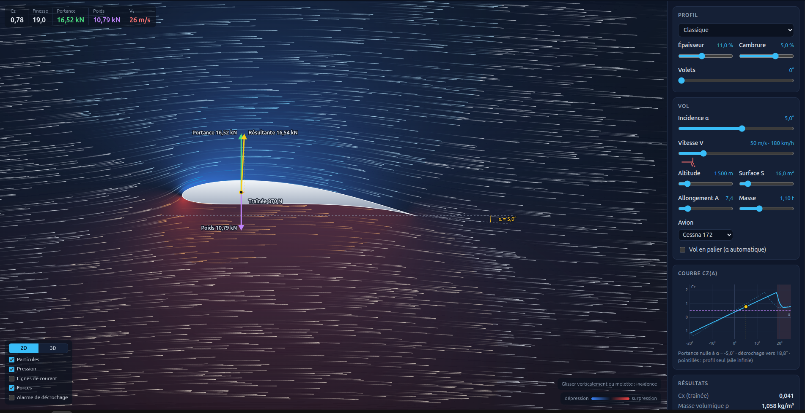

# Wing lift

Interactive wind tunnel in the browser: pick an airfoil, tilt it, and watch the air flow, the pressure field and the aerodynamic forces.

**Live:** https://fallais.github.io/wing-lift/



- Airfoil presets (classic, symmetric, flat plate, high camber) or custom thickness/camber, plus flaps (0 to 40°)
- 3D view (drag or one finger to orbit, wheel or pinch to zoom, double-click to reset, Shift + drag to tilt the wing) or the classic 2D section view (drag vertically or scroll to tilt)
- Angle of attack, airspeed, altitude, wing area
- Air shown as particles, streamlines and a pressure map
- Finite wing (Prandtl's lifting line): aspect ratio slider, induced drag, wingspan, and tip vortices in the 3D view (left half-wing, span shortened on screen)
- Lift, drag and resultant force vectors with values in newtons, plus the CL(α) curve with stall
- Shareable links: the address bar always holds the current setup, and the Share button copies it
- French / English, with a built-in help glossary

## How it works

The flow is the exact potential flow around the airfoil, computed with a linear-strength vortex panel method and the Kutta condition. The shapes are [Joukowski airfoils](https://en.wikipedia.org/wiki/Joukowsky_transform), whose rear quarter can hinge down as a flap; with the flap retracted, the tests check the panel method against the exact conformal-mapping solution. The panel solution is sampled on velocity grids once per shape, in a worker; any angle of attack is then a mix of two precomputed solutions. The whole wing follows Prandtl's lifting-line theory (elliptic loading): the section works at a lower, induced angle, the wing gets induced drag, and in 3D the tip vortices are Biot–Savart line vortices added to the section flow. Stall and profile drag use a simple empirical model on top of that. It is a teaching tool, not a design tool.

The 3D view shows the left half of a straight wing, from the centreline to the tip, with the span shortened on screen to keep the flow readable.

TypeScript (strict), bundled with [Vite](https://vite.dev/):

- `src/aero.ts`: the physics (shapes, panel method, velocity grids, lift and drag, atmosphere), covered by `src/aero.test.ts`
- `src/solver.worker.ts`: builds each shape and its flow off the main thread
- `src/particles.worker.ts`: moves the particles in a Web Worker
- `src/pressure.ts`: the 2D pressure field as a GPU shader, read from the velocity grids
- `src/scene2d.ts` / `src/scene3d.ts`: the two views, same interface (`src/view.ts`); three.js is only loaded for the 3D view
- `src/main.ts`: controls, readouts and the Cz(α) chart

## Run locally

```sh
npm install
npm run dev      # dev server with live reload
npm run check    # lint, formatting, types and tests
npm run format   # apply the formatting
npm run build    # production build in dist/
```

Every push and pull request runs the checks; pushing to `main` also deploys to GitHub Pages (`.github/workflows/deploy.yml`).
